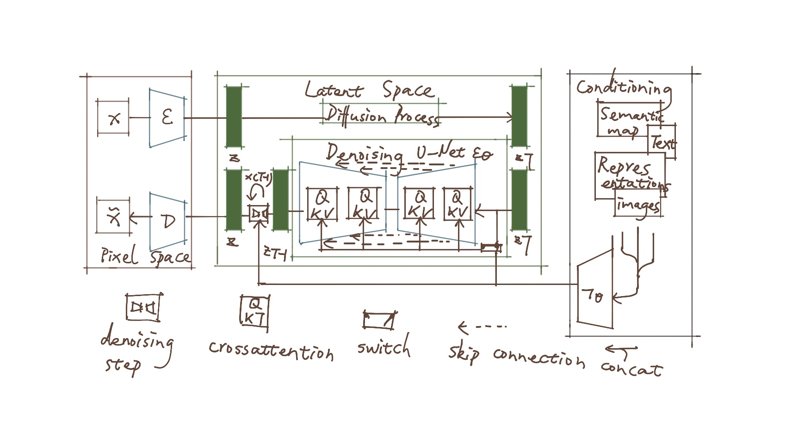
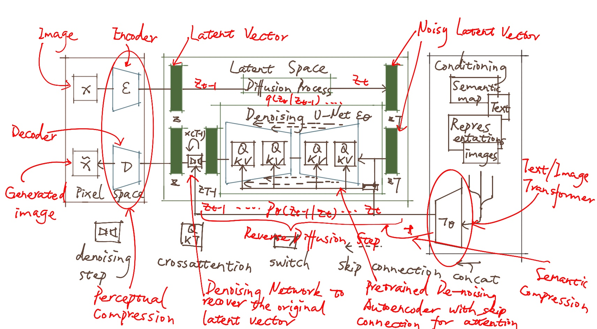

# Fundemental 
## Comfyui advantages
1. 可扩容性长，适合复杂的都行工作
2. 模块化工作
3. 可视化
4. 启动、运行速度快
5. 硬件要求低，CPU即可
6. 可排队运行任务
7. 工作流只需搭建一次，即可保存
8. 由SD原理直接建立的操作界面
9. 可以自己设计需要的模块和模组
10. ctrlnet等插件都支持，还支持ChatGPT及其他功能组模块
## Comfyui disadvantages
1. 上手难
2. 一些插件还未被写成模块

# How comfyui works
1. 扩散模型

2. 图像生产过程中，大部分过程发生在“Latent space”---减少内存和算力的消耗
3. WebUI 无法对生成后的图片进行操作，ComfyUI 可以对生成后的信息进行组合、微调
4. 

